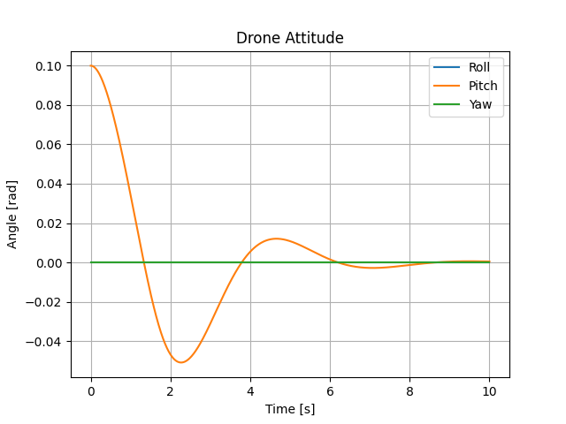
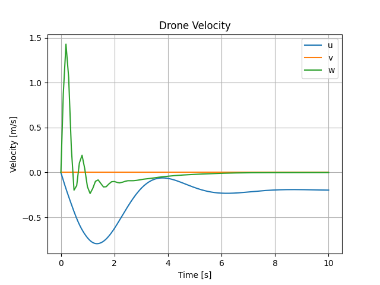
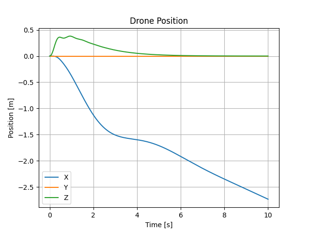
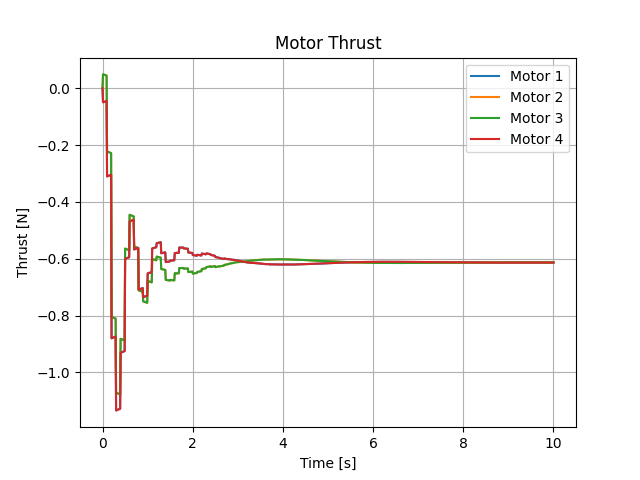

# Copter Control

## Control System Design

I have began designing the control system for my drone. This is using an ideal physical model for the drone (exluding the battery-motor relationship). Using the python `simple-pid` plugin to generate the `delta` of the control variable and feeding that into both a linearized and non-linearized ideal physical quadcopter model to simulate the phsyical response of the controled motor movement. 

### PID Control

...

### Control Systems

Multirotor drone flight controllers must be made up of (at least) three core control systems. These are:

1. roll/pitch control
2. thrust control
3. yaw control

#### Roll/Pitch Control

To start, I randomly picked Gains of:

- Kp = 5
- Ti = 100
- Td = 10

where `Ki = Kp/Ti` and `Kd = Kp/Td`.

I personally re-derived the control moment to motor force transfer matrix, and used linearized and non-linearized equations of motions from my old school notes. The "plant" or state functions take the motor forces as input and output the updated state vector. The state vector, `x`, is:

```
x = [
  x_pos
  y_pos
  z_pos
  phi
  theta
  psi
  x_vel
  y_vel
  z_vel
  p - ang velocity about x
  q - ang velocity about y
  r - ang velocity about z
]
```

The derivative of the state vector, `x_dot`, describe the change of state with time. x_dot is determined by the quadcopter equations of motion, which are functions of motor forces. 

The control system (very basic) block diagram is:


Using this control with the above gains, and the linearized plant equations, we see the following behavior of the drone for a roll disturbance of 0.1 rads.

## Simple PID Control Plots - linear

<table>
  <tr>
    <td>
      
    </td>
    <td>
      
    </td>
  </tr>
  <tr>
    <td>
      
      <p>Notice the lack of drag. Linearization!</p>
    </td>
    <td>
      
    </td>
  </tr>
</table>


## Simple PID Control Plots - nonLinear

<table>
  <tr>
    <td>
      
    </td>
    <td>
      
    </td>
  </tr>
  <tr>
    <td>
      
      <p>We quickly reach terminal velocity downward - no thrust control!</p>
    </td>
    <td>
      
    </td>
  </tr>
</table>



This is currently a WIP. I'm not sure why the velocity and position graphs look/are the same. Very odd

#### Thrust Control

not started

#### Yaw Control

not started - need magnetometer or some other way to determine yaw from start position

## Env Setup

```
source quad/bin/activate
```

```
deactivate
```