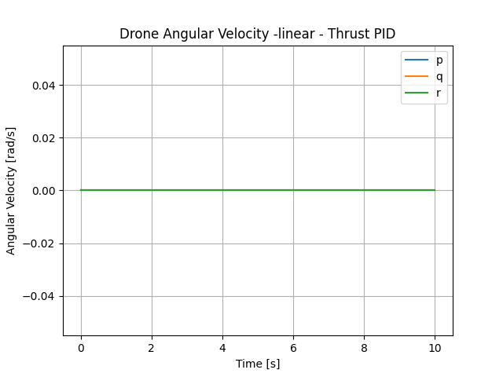
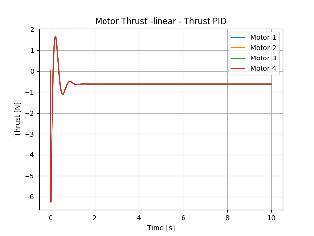

# Copter Control

## Control System Design

I have began designing the control system for my drone. This is using an ideal physical model for the drone (exluding the battery-motor relationship). Using the python `simple-pid` plugin to generate the `delta` of the control variable and feeding that into both a linearized and non-linearized ideal physical quadcopter model to simulate the phsyical response of the controled motor movement. 

### PID Control

...

## Control Systems

Multirotor drone flight controllers must be made up of (at least) three core control systems. These are:

1. roll/pitch control
2. thrust control
3. yaw control

### Roll/Pitch Control

To start, I randomly picked Gains of:

- Kp = 5
- Ti = 100
- Td = 10

where `Ki = Kp/Ti` and `Kd = Kp/Td`.

I personally re-derived the control moment to motor force transfer matrix, and used linearized and non-linearized equations of motions from my old school notes. The "plant" or state functions take the motor forces as input and output the updated state vector. The state vector, `x`, is:

```
x = [
  x_pos
  y_pos
  z_pos
  phi
  theta
  psi
  x_vel
  y_vel
  z_vel
  p - ang velocity about x
  q - ang velocity about y
  r - ang velocity about z
]
```

The derivative of the state vector, `x_dot`, describe the change of state with time. x_dot is determined by the quadcopter equations of motion, which are functions of motor forces. 

The control system (very basic) block diagram is:


Using this control with the above gains, and the linearized plant equations, we see the following behavior of the drone for a roll disturbance of 0.1 rads.

Please __note__: Linear/non-linear refers to state model, not control scheme

#### Simple PID Control Plots - linear

<table>
  <tr>
    <td>
      
    </td>
    <td>
      
    </td>
  </tr>
  <tr>
    <td>
      
      <p>Notice the lack of drag. Linearization!</p>
    </td>
    <td>
      
    </td>
  </tr>
</table>


#### Simple PID Control Plots - nonLinear

<table>
  <tr>
    <td>
      
    </td>
    <td>
      
    </td>
  </tr>
  <tr>
    <td>
      
      <p>We quickly reach terminal velocity downward - no thrust control!</p>
    </td>
    <td>
      
    </td>
  </tr>
</table>


#### Linear vs Non-linear

Here we see the difference between the linearized and non-linear models. Drag is approximated as zero when the EOM's are linearized, so there is no force opposing velocity. We can see this in the linear velocity plot when velocity does not return to zero. Additionally, there is no force of gravity in the linear equations, and as we can see the drone stays in the same Z pos. Oppositely in the non-linear plots, we see that there _is_ drag, and the Y velocity quickly returns back to zero. However, gravity is modeled, so the drone very quickly falls out of the sky. This can be seen with the drone Z position falling well into the depths of hell (positive is Inertial Down) but the Y location remaining relatively the same (it does not remain zero but the plot scale does not show it). 

### Thrust Control

#### Linear

<table>
  <tr>
    <td>
      
    </td>
    <td>
      
    </td>
  </tr>
  <tr>
    <td>
      
    </td>
    <td>
      
    </td>
  </tr>
</table>



#### Non-Linear

<table>
  <tr>
    <td>
      
    </td>
    <td>
      
    </td>
  </tr>
  <tr>
    <td>
      
    </td>
    <td>
      
    </td>
  </tr>
</table>


#### Linear vs Non-linear

Notice that the thrust control only works with the non-linear equations, as gravity is modeled here.

### Yaw Control

not started - need magnetometer or some other way to determine yaw from start position

## Some of the Math

### PID Math

If you want to see a couple of different ways to model PID systems explicitly, look at the scripts in `src/examples/`. The `sample-pid.py` script uses an explicitly solved ODE function (the PID ODE) to control a simple step function. The `transfer-function-example.py` script uses the python `control` package to generate a transfer function and control a step function.

In the pitch-roll and thrust PID controllers, I use the `simple-pid` python package to generate the drive value. This cuts out dependencies in order to run efficiently in micro-python. 

### Equations of motion

I will write these up in latex but do not know how to integrate that into markdown so will not have these for now.

### Numerical Integration

I chose the simplest possible numerical integration model to start - explicit Euler:

```
x_{k+1} = x_{k} + f(x_{k},u_{k},p)*dt
```

Using a time step of `dt=0.1s` has worked well with this method, although I am looking into using Runge-Kutta or an implicit Euler method for more accurate analysis.

## Env Setup

```
source quad/bin/activate
```

```
deactivate
```