# Copter Control

This directory contains code relating to my quadcopter Flight Control design. I am currently in the modeling stage - trying to pick correct gains to plug into the `simple-pid` micropython plugin running on the drone.

Control System Next Steps:
- Solve remaining velocity issue in combined control system
- Investigate and implement Yaw control
- Investigate micropython ultra-quick matrix manipulation and math
- Write FC script for drone control - no model response, angle data fed to control is from on-drone IMU

## Table of Contents
- [Copter Control](#copter-control)
  - [Table of Contents](#table-of-contents)
  - [Control System Design](#control-system-design)
    - [PID Control](#pid-control)
  - [Control Systems](#control-systems)
    - [Complete Control](#complete-control)
    - [Roll/Pitch Control](#rollpitch-control)
      - [Simple PID Control Plots - linear](#simple-pid-control-plots---linear)
      - [Simple PID Control Plots - nonLinear](#simple-pid-control-plots---nonlinear)
      - [Linear vs Non-linear](#linear-vs-non-linear)
    - [Thrust Control](#thrust-control)
      - [Linear](#linear)
      - [Non-Linear](#non-linear)
      - [Linear vs Non-linear](#linear-vs-non-linear-1)
    - [Yaw Control](#yaw-control)
  - [Some of the Math](#some-of-the-math)
    - [PID Math](#pid-math)
    - [Equations of motion](#equations-of-motion)
      - [Linear EOM's](#linear-eoms)
      - [Non-linear](#non-linear-1)
    - [Numerical Integration](#numerical-integration)

## Control System Design

I have began designing the control system for my drone. This is using an ideal physical model for the drone (exluding the battery-motor relationship). Using the python `simple-pid` plugin to generate the `delta` of the control variable and feeding that into both a linearized and non-linearized ideal physical quadcopter model to simulate the phsyical response of the controled motor movement. 

### PID Control

...

## Control Systems

Multirotor drone flight controllers must be made up of (at least) three core control systems. These are:

1. roll/pitch control
2. thrust control
3. yaw control

### Complete Control

Here are the plots for the combination of the [roll/pitch control](#rollpitch-control), [thrust control](#thrust-control) and [yaw control](#yaw-control). We can see that, after some gain tuning, the drone attitude and vertical velocity settle to zero. However, the drone Y velocity does not settle to zero - it looks as if drag doesn't act on the drone, which is very confusing.

<table>
  <tr>
    <td>
      
    </td>
    <td>
      
    </td>
  </tr>
  <tr>
    <td>
      
    </td>
    <td>
      
    </td>
  </tr>
</table>


### Roll/Pitch Control

To start, I randomly picked gains of:

- Kp = 5
- Ti = 100
- Td = 10

where `Ki = Kp/Ti` and `Kd = Kp/Td`. I then tuned the gains manually (no method) for the results.

I personally re-derived the control moment to motor force transfer matrix, and used linearized and non-linearized equations of motions from my old school notes. The "plant" or state functions take the motor forces as input and output the updated state vector. The state vector, `x`, is:

```
x = [
  x_pos
  y_pos
  z_pos
  phi
  theta
  psi
  x_vel
  y_vel
  z_vel
  p - ang velocity about x
  q - ang velocity about y
  r - ang velocity about z
]
```

The derivative of the state vector, `x_dot`, describe the change of state with time. x_dot is determined by the quadcopter equations of motion, which are functions of motor forces. 

The control system (very basic) block diagram is:

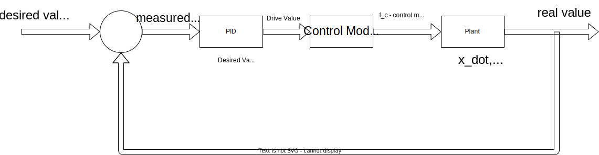

Using this control with the above gains, and the linearized plant equations, we see the following behavior of the drone for a roll disturbance of 0.1 rads.

Please __note__: Linear/non-linear refers to state model, not control scheme

#### Simple PID Control Plots - linear

Control Target: `Phi = 0`, `Roll=0` rads, IC: `Phi = 0`, `Roll=0.1` rads.

Using gains of:

- Kp = 9000
- Ki = 100
- Kd = 600

<table>
  <tr>
    <td>
      
    </td>
    <td>
      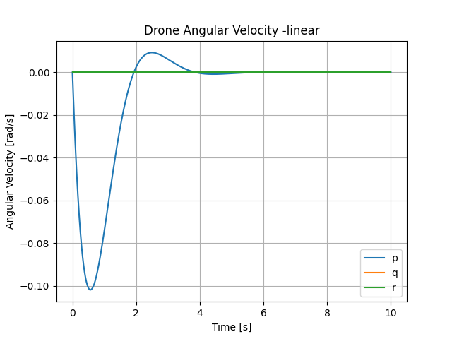
    </td>
  </tr>
  <tr>
    <td>
      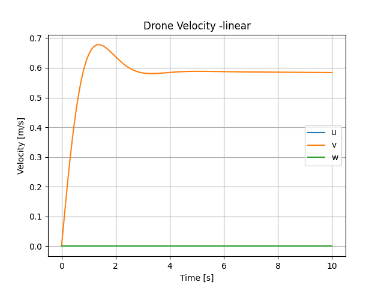
      <p>Notice the lack of drag. Linearization!</p>
    </td>
    <td>
      
    </td>
  </tr>
</table>

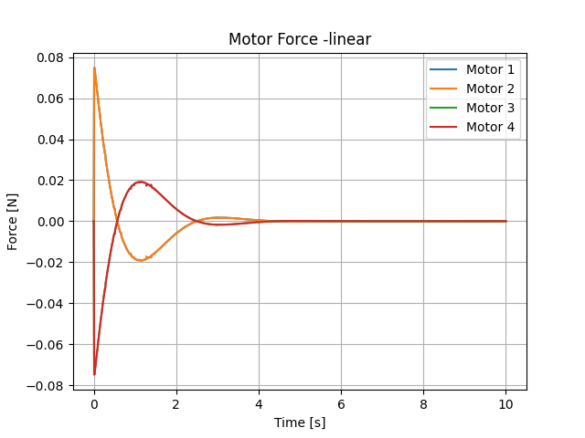

#### Simple PID Control Plots - nonLinear

<table>
  <tr>
    <td>
      
    </td>
    <td>
      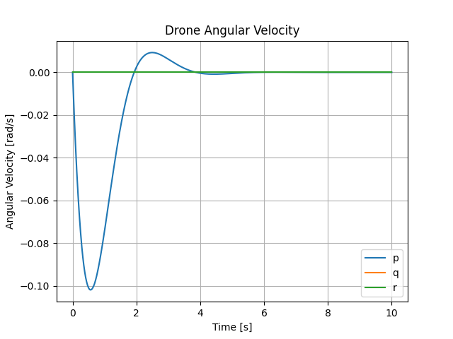
    </td>
  </tr>
  <tr>
    <td>
      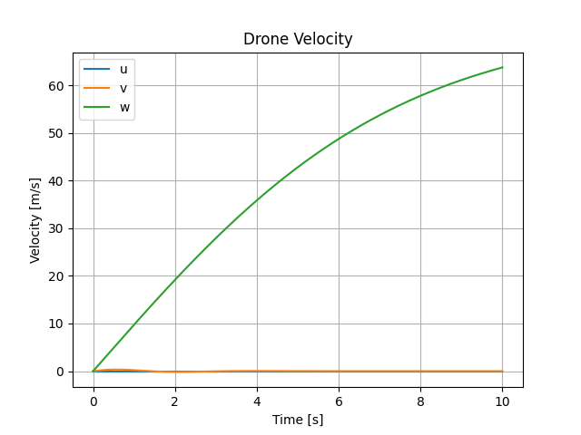
      <p>We quickly reach terminal velocity downward - no thrust control!</p>
    </td>
    <td>
      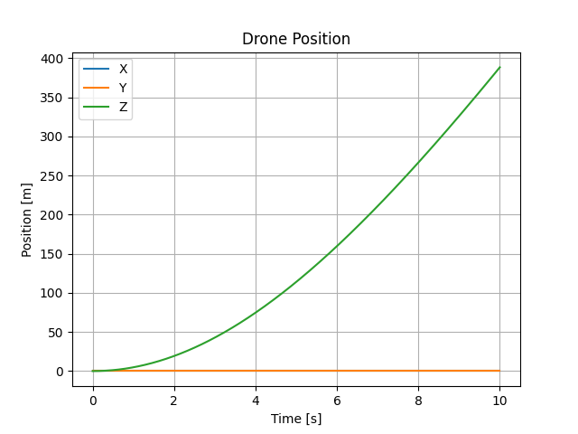
    </td>
  </tr>
</table>


  <tr>
    <td>
      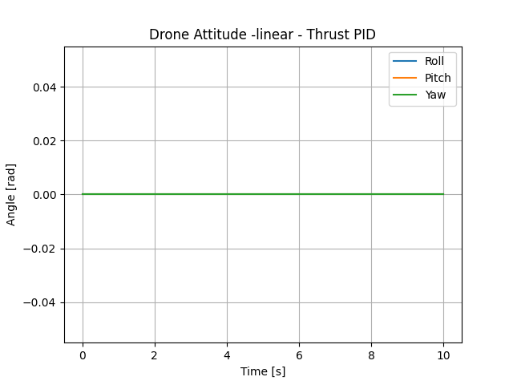
    </td>
    <td>
      
    </td>
  </tr>
  <tr>
    <td>
      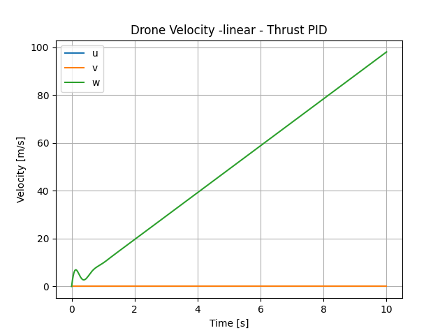
    </td>
    <td>
      
    </td>
  </tr>
</table>


#### Non-Linear

<table>
  <tr>
    <td>
      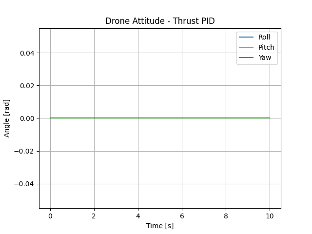
    </td>
    <td>
      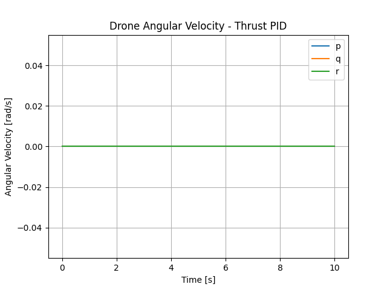
    </td>
  </tr>
  <tr>
    <td>
      
    </td>
    <td>
      
    </td>
  </tr>
</table>

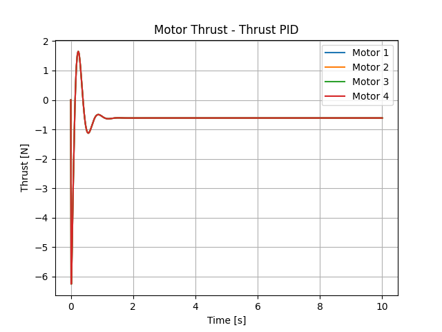

#### Linear vs Non-linear

Notice that the thrust control only works with the non-linear equations, as gravity is modeled here.

### Yaw Control

not started - need magnetometer or some other way to determine yaw from start position

## Some of the Math

### PID Math

If you want to see a couple of different ways to model PID systems explicitly, look at the scripts in `src/examples/`. The `sample-pid.py` script uses an explicitly solved ODE function (the PID ODE) to control a simple step function. The `transfer-function-example.py` script uses the python `control` package to generate a transfer function and control a step function.

In the pitch-roll and thrust PID controllers, I use the `simple-pid` python package to generate the drive value. This cuts out dependencies in order to run efficiently in micro-python. 

### Equations of motion

#### Linear EOM's


#### Non-linear

### Numerical Integration

I chose the simplest possible numerical integration model to start - explicit Euler:

```
x_{k+1} = x_{k} + f(x_{k},u_{k},p)*dt
```

Using a time step of `dt=0.01s` has worked well with this method, although I am looking into using Runge-Kutta or an implicit Euler method for more accurate analysis.